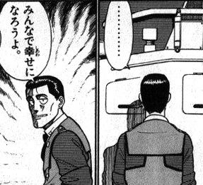

= 所信表明
:toc: left
:toc-title: 目次
:auther: 中島慎児
:source-highlighter: coderay
:pdf-page-size: A4
:pdf-page-layout: landscape

== やりたい事

[options="incremental"]
* 横の連携を増やしたい +
* 心の中に道具箱を持ちたい +

=== 横の連携を増やしたい！ +

個々人は素晴らしい技術を持っている。 +
あの人はこんなことができる。この人はこれが詳しい。 +
でも、誰がどんな技術を持っているかは、意外と知らないかもしれない。 +

<<<

技術はお金と違って分け合っても減らないです。 +
みんなで分け合いましょう。 +
（俺の知らんことを教えてくれ） +

=== 心の中に道具箱を持ちたい！ +

できることを増やしましょう。
Rubyにしても、Javaにしても、.Netにしても残念ながら技術は移ろっていくもの。 +
その移ろいゆく中でも、システムの上から下まで触ることができるようになれば… +
きっと次につながるはず。 +

<<<

現在の標準的な手段を手に入れましょう。 +
いっぺんにぜんぶ覚えなくても大丈夫。 +
今のあなたが金づちとのこぎりが使えるなら、次はカンナを試してみましょう。 +
すでに一通り使えるあなたは、もっと便利な電動工具を試してみませんか。 +
こんな風に、少しずつ増やしていけばOK +

=== みんなで幸せになろうよ。 +

